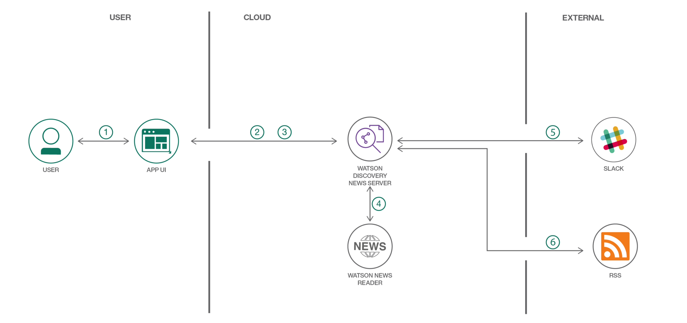

# llSPS-INT-214-AI-Powered-News-Search-App-Level-1-
AI Powered News Search App (Level-1)

## Summary

The web consists of large amount of data. These data's can be extracted from the web and can be used for various purposes. So various companies can get this data to gain understanding, make stratergies and find opportunities. These data's can make your application efficient and faster. So basically, we create an AI powered news search app to mine data using Node.js and Watson Discovery service.

Here:
* Code is written in Node.js
* You'll use the pre-built Watson Discovery News collection
* You'll access the Watson Discovery service through the Watson Discovery API

Additionally, you can choose to:

* Use a Slack interface to query the data
* Push news alerts out to an RSS reader
* Host the app on the IBM Cloud

## Description

This application shows you on how to search massive data sets to mine insight. A news mining web application can be built with the Watson Discovery service using the Watson Node.js SDK. The app demonstrates two use cases using Watson Discovery News:

* **Search**: Query for the most relevant news articles about a input given by the user. Because the news collection is pre-enriched with natural language processing, you can query not just on keywords or categories but also on concepts, sentiment, and relations to get richer search responses.

* **Trending topics in the news**: Identify popular topics over the past 24 hours. Topics can be general, or specific to an industry or category.

## Flow

1. The user interacts with the Watson Discovery News Server via the app UI.
1. User input is processed and routed to the Watson Discovery News Server.
1. The Watson Discovery News Server sends user requests to the Watson Discovery Service.
1. The Watson Discovery Service queries the Watson News Collection.
1. The Watson Discovery Service responds to Slack search requests.

# Included components

* [Watson Discovery](https://www.ibm.com/watson/services/discovery/): A cognitive search and content analytics engine for applications to identify patterns, trends, and actionable insights.

# Procedure

* **Reference** https://drive.google.com/file/d/18ZJanZI2q5zxlUGp1eqEr-9rawiwRshX/view

* **Discovery**
1. Create an IBM cloud account.
1. Open discovery from IBM cloud catalog.
1. Select region as London and give an unique service name to create the discovery.
1. Under services from resource list, open the created discovery.
1. Click on launch discovery.


* **Node Red**
1. Open node red from IBM cloud catalog.
1. Select Chennai region and click create.
1. Once it is created, create a new API key.
1. Select region as london and change memory allocation to 256 mb, then press create.
1. Under cloud foundry apps from resource list open the node red app.
1. Click on visit app url to open Node red editor
1. Click next until it shows the finish option.
1. Click finish to open node red flow editor.
1. From manage palette option, install node-red-dashboard.
1. Create the flow as given below
1. In the discovery node, paste the API key by copying it from service credentials of the discovery.
1. After creating the flow, deploy it.
1. Open the UI using (node-red-editor link)/ui
  


# UI output


# Sentimental analysis flow

* **Reference** https://drive.google.com/file/d/1GMie9-u5IztLwaeUuo7Pt2dIKfUJfAbM/view?usp=sharing

* **Procedure**
1. Install node-red-node-sentiment from manage palette
1. Create the flow as given below with required coding


# Sentimental analysis output


# Featured technologies

* [Node.js](https://nodejs.org/en/): An asynchronous event driven JavaScript runtime, designed to build scalable applications
* [Slack](https://slack.com): Slack is a cloud-based set of team collaboration tools and services with chat bot integration
* [Botkit](https://www.botkit.ai): Framework for creating and managing chat bots

# Extra Credit

Now since we have built the base application, we can also add some additional steps that can take to add a Slack interface, and/or provide a way to send new trending news topics to your favorite RSS feed.

## 1. Configure Slack

To integrate a new Slack Bot into your existing Slack team, navigate to `https://<my.slack.com>/apps/manage/custom-integrations`, where `<my.slack.com>` is the Slack workspace you want to customize.

  1. From the **Cutsom Integrations** page, select the **Bots** option.


  2, To add a new bot, select the **Add Configuration** button.


  3. Enter a username for the bot and click **Add bot integration**.


  4. Once created, save the **API Token** that is generated.


## 2. Configure the application to use the Slack bot

### If you runnint the app locally...

  1. Edit the .env file and enter the Slack Bot **API Token** saved in the previous step.

```bash
# Slack
SLACK_BOT_TOKEN=<slack_bot_token>
```

  2. Restart the application.

## Search from Slack

The slack bot will respond to certain key words, below is a sample dialog. Remember to `@` the bot each time, or start a private chat. Make sure to invite your bot into other channels using `/invite @<my bot>`.

```bash
user: @newsbot hi
newsbot: Hello.

user: @newsbot news please
newsbot: Hi there! What news are you interested in?

user: @newsbot toronto raptors
newsbot: You want me to search for news articles about `toronto raptors`?

user: @newsbot yes
newsbot: OK searching...
```

# Slack output


# Links

* [Demo on Youtube](https://youtu.be/EZGgvci9nC0): Watch the video.
* [Watson Node.js SDK](https://github.com/watson-developer-cloud/node-sdk): Download the Watson Node SDK.
* [Cognitive discovery architecture](https://www.ibm.com/cloud/garage/architectures/cognitiveDiscoveryDomain): Learn how this code pattern fits into the Cognitive discovery Reference Architecture.
* [Overview of the Watson Discovery service](https://www.ibm.com/watson/services/discovery/): Extract value from unstructured data by converting, normalizing, enriching it.
* [Three ways IBM has evolved Alchemy Data News into Watson Discovery News and made it even better](https://www.ibm.com/blogs/watson/2017/04/3-ways-ibm-evolved-alchemy-data-news-watson-discovery-news-made-even-better/): Watson Discovery News takes big steps forward in NLP-enriched news search.
* [IBM launches Watson Discovery Service for big data analytics at scale](https://www.techrepublic.com/article/ibm-launches-watson-discovery-service-for-big-data-analytics-at-scale/):
Suite of APIs makes it easier for companies to ingest and analyze their data, even if they don’t have advanced degrees in data science.
* [SlideShare: Building with Watson – Network Visualizations using Watson Discovery](https://www.slideshare.net/IBMWatson/building-with-watson-network-visualizations-using-watson-discovery): See an app built on the Watson Discovery Service and D3.js that helps you explore your data using a network map built on NLP metadata.

